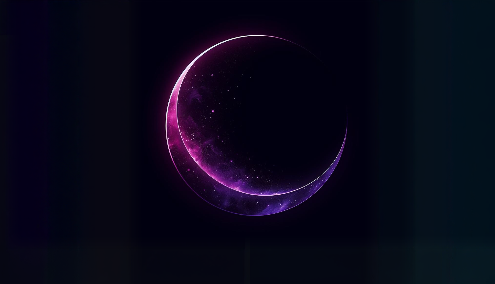

[](https://ibaigz.com)

<h1 align="center">
  Hi, I'm Ibai 
</h1>

<div align="center">
  <p>Full Stack Developer | Always Learning | Building Cool Stuff</p>
</div>

---

## 🚀 About Me

```
⚡ Learning new things every day
💻 Passionate about web development & cloud solutions
🎮 Occasional game developer
```

---

## 🛠️ Tech Stack

<div align="center">

### Frontend


### Backend & Database


### DevOps & Tools


### Other


</div>

---

## 🎯 What I'm Into

- 🌐 Building modern web applications
- ☁️ Cloud architecture & AWS solutions
- 📦 Docker & containerization
- 🎮 Game development with Unity
- 🔐 Backend development with Laravel & PHP

---

## 📈 Profile Activity

<div align="center">
  
[](https://github.com/ibaigz)

</div>

---

<div align="center">
  <p>Welcome :)</p>
</div>
